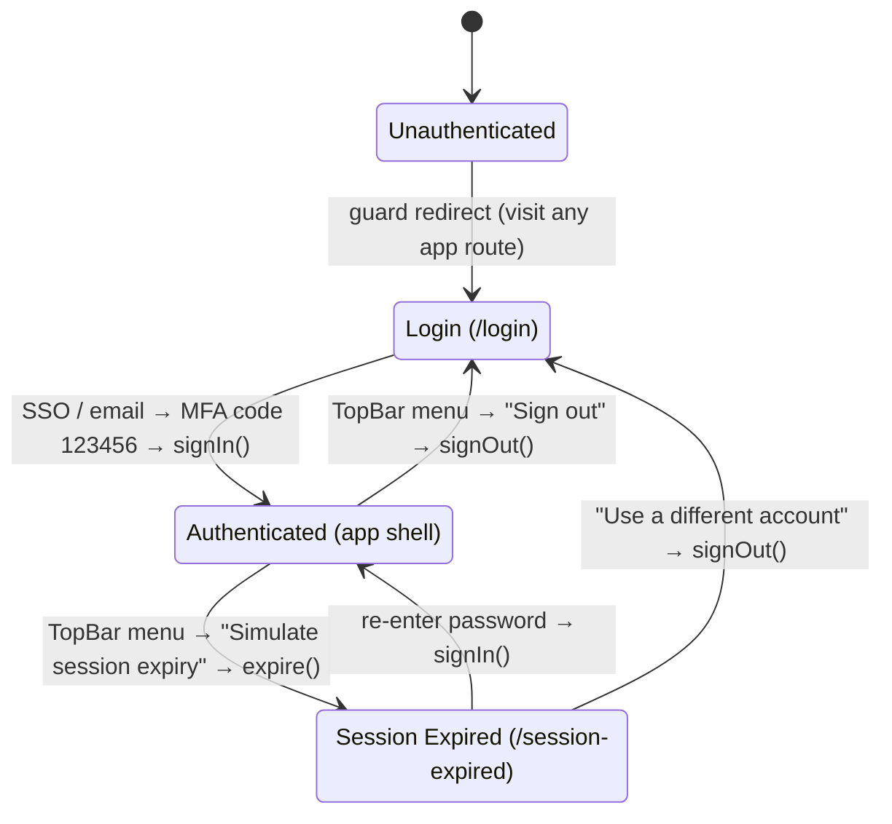

# Authentication flow

How auth works in the Interloid Workforce HRMS frontend. **It is fully stubbed and client-side —
there is no backend.** Sign-in, MFA, re-auth and expiry are simulated with timers; no credentials
leave the browser. This documents the wiring so the real integration (Microsoft Entra ID / a session
API) has a clear seam to slot into.

## The session model

`src/features/auth/` owns the session:

- **`use-auth.ts`** — `AuthContext` + the `useAuth()` hook. Shape:
  - `status`: `'authenticated' | 'unauthenticated' | 'expired'`
  - `user`: `{ name, email } | null`
  - `signIn(user?)` · `signOut()` · `expire()`
- **`auth-provider.tsx`** — `AuthProvider` holds the state and **persists it to `sessionStorage`**
  (key `iws.auth`), so a refresh keeps you where you were. Mounted in `AppProviders`, above the
  router, so both the guard and the screens can read it.

`signIn` → `authenticated` (+ user); `signOut` → `unauthenticated` (clears user); `expire` →
`expired` (keeps the user so the re-auth screen can greet them).

## The route guard

`src/app/layouts/protected-layout.tsx` (`ProtectedLayout`) wraps every app route and reads `status`:

| status            | guard renders                      |
| ----------------- | ---------------------------------- |
| `authenticated`   | `<MainLayout>` (the app shell)     |
| `expired`         | `<Navigate to="/session-expired">` |
| `unauthenticated` | `<Navigate to="/login">`           |

Because the redirect is driven by state, changing `status` **anywhere** (e.g. the TopBar user menu)
makes the guard react on the next render — Session Expired is reached _through the guard_, not by
typing the URL.

### Route map (`src/app/router.tsx`)

- **Public** (no guard, no shell): `/login`, `/account-setup`, `/forgot-password`,
  `/reset-password`, `/session-expired`.
- **Protected** (under `ProtectedLayout`, `errorElement = ServerErrorPage`): `/`, `/dev/*`
  (incl. `/dev/throw`, which throws on render to exercise the error page).
- **Catch-all**: `*` → full-page 404.

## The flow

**Sign in.** Visiting any app route while unauthenticated → guard → `/login`. The Login screen runs
SSO (or the email form) → a 6-digit MFA step (demo code **`123456`**). On success it calls `signIn()`
and navigates to `/`; the guard now allows the app.

**Session expiry & re-auth.** The **TopBar user menu** ("Simulate session expiry") calls `expire()`.
`status` becomes `expired`, the guard redirects to `/session-expired`, which greets the persisted user
and asks for the password. Any password ≥ 6 chars re-authenticates (`signIn()`) and returns to the
app. "Use a different account" calls `signOut()` → `/login`.

**Sign out.** The TopBar user menu "Sign out" calls `signOut()` → guard → `/login`.

## Where each screen lives

| Screen          | Route                | Layout              | Purpose                                  |
| --------------- | -------------------- | ------------------- | ---------------------------------------- |
| Login           | `/login`             | two-pane (showcase) | SSO → email → MFA → `signIn`             |
| Account Setup   | `/account-setup`     | centered glass card | invited user activates (create password) |
| Forgot Password | `/forgot-password`   | two-pane (showcase) | email → reset link sent                  |
| Reset Password  | `/reset-password`    | two-pane (showcase) | new password (strength/rules) → done     |
| Session Expired | `/session-expired`   | centered glass card | **guard target** — re-auth with password |
| Not Found       | `*`                  | full-page           | 404 fallback                             |
| Server Error    | route `errorElement` | full-page           | 500 fallback (retry demo)                |

## ⚠ What is NOT real (the integration seam)

- No network calls — every step is a `setTimeout`. MFA accepts only `123456`; re-auth / setup accept
  any password meeting the rule threshold.
- The session lives only in `sessionStorage`; there is no token, cookie, refresh, or server check.
- Demo identities (Priya Nair, Diya Sharma / ITL-0187) and the notification/stat content are hardcoded.

To make it real: replace the `setTimeout` bodies in the auth panels + `SessionExpiredCard` with API
calls, have `signIn` store a real token, and add a session check (token validity / refresh) that flips
`status` to `expired`. The guard, routes, and screens stay as-is.
